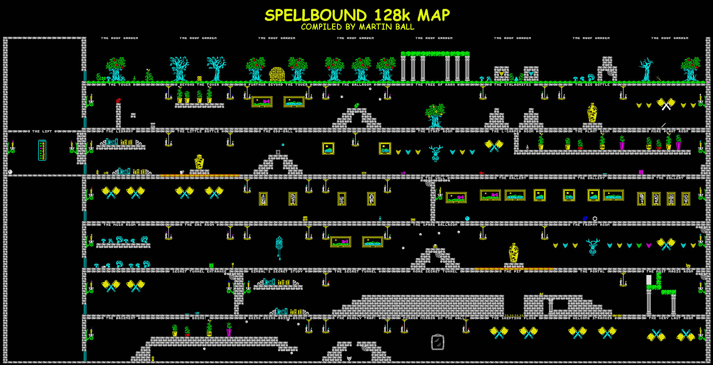

# Phaser spellbound mockup

running in netlify! see [netlify](https://kwspbound-phaser.netlify.app/)

# Map of the original game below

## Requirements

[Node.js](https://nodejs.org) is required to install dependencies and run scripts via `npm`.

## Available Commands

| Command         | Description                                    |
| --------------- | ---------------------------------------------- |
| `npm install`   | Install project dependencies                   |
| `npm run dev`   | Launch a development web server                |
| `npm run build` | Create a production build in the `dist` folder |

## Writing Code

After cloning the repo, run `npm install` from your project directory. Then, you can start the local development server by running `npm run dev`.

The local development server runs on `http://localhost:8080` by default. Please see the Vite documentation if you wish to change this, or add SSL support.

Once the server is running you can edit any of the files in the `src` folder. Vite will automatically recompile your code and then reload the browser.

# Outstanding features

## Inventory
Allows you to carry 5 items (iss #31)

## Colourful fonts 
Need to figure out how to colour the fonts for the various panels/etc (iss #32)

## NPCs should walk around
NPCs should be able to walk around when not onscreen and not asleep (iss #33)
NPCs can walk into the lift

## Lift should move by itself
should move between floors (iss #34)

## Menu system for overlapping menus and showing available commands
Popup dialog system (iss #35)
Choose the Verb "give"
Choose the Subject "give [ITEM]"
Choose the Object "give [ITEM] to [PERSON]"

## Menu for doing commands (pick up XXX, talk to XXX, drop object XXX, call lift, cast spell, give item to XXX, take item from XXX, teleport)
## Menu for inventory (drop XXX, pick up XXX)
## Menu for ordering people (command florin to blow the horn)
## Mirror + Inventory panel at bottom of the screen
Whilst you are carrying the mirror, the inventory panel appears at bottom of the screen

## panel at bottom of screen
Shows copyright message usually - DONE
Can show inventory if mirror is carried
Shows command builder (iss #36)

## knight animation
(iss #37)
* Knight should face the direction of travel (iss #37)
* Knight should animate walking (iss #37)
* Teleport animation disappear (iss #38)
* Teleport animation appear (iss #38)

## Teleport
Whilst you are carrying the teleportkey (iss #38)
New menuitem for "teleport" (iss #38)
When you select "teleport" it takes you to the telepad (iss #38)

## Glowing bottle
Whilst you are carrying the glowingbottle
DarkRooms wont kill you (iss #39)

## Powerpong plant
Whilst you are carrying the PowerPong plant (iss #40)
Poisouns rooms wont kill you

## Room Poperties
* Dark - kills you with tripping over (iss #39)
* Lift - Allows you to move between floors (enables the menu item)
* Poisonous - Kills you with gas (iss #40)

## Health bar
Should decrease as you walk between screens or run a command (iss #41)

##' object attributes
Weight (iss #42)

## character attributes
maxweight per item (iss #43)
max number of items (iss #44)

## Sound
* Sound on menu item
* Background Music

## Join the Phaser Community!

We love to see what developers like you create with Phaser! It really motivates us to keep improving. So please join our community and show-off your work 😄

**Visit:** The [Phaser website](https://phaser.io) and follow on [Phaser Twitter](https://twitter.com/phaser_) 
**Play:** Some of the amazing games [#madewithphaser](https://twitter.com/search?q=%23madewithphaser&src=typed_query&f=live) 
**Learn:** [API Docs](https://newdocs.phaser.io), [Support Forum](https://phaser.discourse.group/) and [StackOverflow](https://stackoverflow.com/questions/tagged/phaser-framework) 
**Discord:** Join us on [Discord](https://discord.gg/phaser) 
**Code:** 2000+ [Examples](https://labs.phaser.io) 
**Read:** The [Phaser World](https://phaser.io/community/newsletter) Newsletter 

Created by [Phaser Studio](mailto:support@phaser.io). Powered by coffee, anime, pixels and love.

The Phaser logo and characters are &copy; 2011 - 2024 Phaser Studio Inc.

All rights reserved.
